# Implementation Roadmap & 72-Hour Execution Plan — Dogfood 2026
**Document ID:** `ROADMAP-DOGFOOD-2026-V1`  
**System Title:** Dogfood 2026 72-Hour Sprint Implementation Plan  
**Target Event:** Hackathon Raptors 72-Hour Sprint  
**Document Status:** Approved Operational Schedule  
**Authors:** Dogfood 2026 Engineering Team (Somnath, Falguni, Om Apar)  

---

> [!TIP]
> **Core Strategy for Hackathon Execution**  
> **Mandatory Tier 1 $\rightarrow$ Rock-Solid Tier 2 $\rightarrow$ One Standout Feature (Score Normalization & Pairwise Judging) $\rightarrow$ Polish & Offline Air-Gap Verification.**  
> A pristine, bulletproof Tier 2 beats a half-broken Tier 4 every single time. Tier 2 represents 25% of the evaluation score and is the hardest tier to fake.

---

## Table of Contents
1. [72-Hour Sprint Chronology & Timeline](#1-72-hour-sprint-chronology--timeline)
2. [Detailed Phase-by-Phase Execution Schedule](#2-detailed-phase-by-phase-execution-schedule)
   - [2.1 Phase 1: Environment Baseline & Container Scaffolding (Hours 00 – 12)](#21-phase-1-environment-baseline--container-scaffolding-hours-00--12)
   - [2.2 Phase 2: Tier 1 Core Platform Foundation (Hours 12 – 28)](#22-phase-2-tier-1-core-platform-foundation-hours-12--28)
   - [2.3 Phase 3: Tier 2A Judging Rubrics & Isolation (Hours 28 – 44)](#23-phase-3-tier-2a-judging-rubrics--isolation-hours-28--44)
   - [2.4 Phase 4: Tier 2B Normalization, Leaderboard & CSV Export (Hours 44 – 56)](#24-phase-4-tier-2b-normalization-leaderboard--csv-export-hours-44--56)
   - [2.5 Phase 5: Tier 3 & Bonus Features (Hours 56 – 64)](#25-phase-5-tier-3--bonus-features-hours-56--64)
   - [2.6 Phase 6: Air-Gap Audit, Polish & Packaging (Hours 64 – 72)](#26-phase-6-air-gap-audit-polish--packaging-hours-64--72)
3. [Granular Work Breakdown Structure (WBS)](#3-granular-work-breakdown-structure-wbs)
4. [Milestone Verification Gates](#4-milestone-verification-gates)
5. [Risk Management & De-Scoping Fallback Matrix](#5-risk-management--de-scoping-fallback-matrix)
6. [Definition of Done (DoD) Quality Checklists](#6-definition-of-done-dod-quality-checklists)
7. [Document Revision History](#7-document-revision-history)

---

## 1. 72-Hour Sprint Chronology & Timeline

```mermaid
gantt
    title Dogfood 2026 72-Hour Implementation Schedule
    dateFormat X
    axisFormat Hour %s

    section Phase 1: Base & Infra
    Scaffolding & Docker Compose       :active, p1, 0, 12
    MongoDB Seeding & Fast Healthchecks:p1b, 6, 12

    section Phase 2: Tier 1 Core
    Local JWT Auth & Role Middleware   :p2a, 12, 22
    Team Formation & Join Codes        :p2b, 16, 24
    Submission Lifecycle & Multer      :p2c, 20, 28
    Public Showcase Gallery & Search   :p2d, 22, 28

    section Phase 3: Tier 2A Judging
    Weighted Rubric Builder            :p3a, 28, 36
    Constraint Judge Assignment Engine :p3b, 32, 42
    Route-Level Score Isolation Guard  :p3c, 36, 44
    Judge Scoring UI & Auto-Save       :p3d, 36, 44

    section Phase 4: Tier 2B Stats
    FastAPI Z-Score Normalization Core :p4a, 44, 52
    Empirical Bayesian Shrinkage Engine:p4b, 48, 56
    Organizer Leaderboard & CSV Export :p4c, 50, 56

    section Phase 5: Tier 3 & Bonus
    Anti-Abuse Community Voting (IP/UA):p5a, 56, 62
    Bradley-Terry Pairwise Ranking MM  :p5b, 58, 64
    Immutable Audit Logging            :p5c, 60, 64

    section Phase 6: QA & Package
    Air-Gap Verification Disconnect Test:p6a, 64, 68
    Acceptance Report & Final Freeze   :p6b, 68, 72
```



---

## 2. Detailed Phase-by-Phase Execution Schedule

### 2.1 Phase 1: Environment Baseline & Container Scaffolding (Hours 00 – 12)
- **Objective:** Establish unified multi-container local runtime with zero external network connectivity.
- **Key Tasks:**
  - Initialize Git repo with `.gitignore`, branch rules, and Conventional Commits.
  - Author `docker-compose.yml` orchestrating `frontend`, `api`, `judging-service`, and `mongodb`.
  - Author `seed/init-mongo.js` creating mock organizer, judges, teams, and submissions.
  - Verify container healthchecks cascade properly (`api` waits for `mongodb` and `judging-service`).
- **Phase Gate 1:** `docker compose up --build` brings up all 4 containers in $< 120\text{ seconds}$ with zero errors.

### 2.2 Phase 2: Tier 1 Core Platform Foundation (Hours 12 – 28)
- **Objective:** Deliver full participant lifecycle from registration to project showcase.
- **Key Tasks:**
  - **Somnath (Backend):** Implement JWT local auth (`/register`, `/login`, `/me`), bcrypt hashing, `roleGuard` middleware, team join codes (6-character uppercase), and Multer multipart upload pipeline.
  - **Falguni (Frontend):** Build authentication views, responsive navigation with local offline badge, team roster editor, dual-pane markdown submission editor with live preview, and public gallery grid.
  - **Om Apar (ML/Stats):** Setup FastAPI skeleton, Pydantic schemas, and Pytest configuration.
- **Phase Gate 2:** A participant registers, forms a team, uploads an image thumbnail, finalizes submission, and sees project rendered in the public gallery.

### 2.3 Phase 3: Tier 2A Judging Rubrics & Isolation (Hours 28 – 44)
- **Objective:** Implement organizer rubric designer, automated judge assignment, and backend-enforced route isolation.
- **Key Tasks:**
  - **Somnath (Backend):** Build weighted rubric API (`$\sum w_i = 1.0$`), greedy constraint judge assignment solver, and `isolationGuard.js` blocking cross-judge score access.
  - **Falguni (Frontend):** Build Judge Evaluation Portal with interactive criteria sliders ($1-10$, step $0.5$), auto-saving private notes, and keyboard shortcuts.
  - **Om Apar (ML/Stats):** Implement core mathematical z-score normalization and unit tests in Python.
- **Phase Gate 3:** Judges can log in, view only their assigned queue, submit rubric scores, and direct API penetration tests attempting to access competing judge scores return `403 Forbidden`.

### 2.4 Phase 4: Tier 2B Normalization, Leaderboard & CSV Export (Hours 44 – 56)
- **Objective:** Connect Node API to FastAPI microservice; deliver calibrated rankings and CSV reporting.
- **Key Tasks:**
  - **Om Apar (ML/Stats):** Implement Empirical Bayesian shrinkage for small samples ($N < 5$), composite aggregation, and Min-Max $0-100$ rescaling at `/api/v1/normalize`.
  - **Somnath (Backend):** Integrate Node API client to call FastAPI, cache normalized ranks, and build streaming CSV exporter.
  - **Falguni (Frontend):** Build Organizer Command Center featuring live completion metrics, toggleable Raw vs. Normalized leaderboard views, and Recharts score variance charts.
- **Phase Gate 4:** Organizer triggers normalization; algorithm stabilizes variance; live leaderboard updates; one-click CSV download outputs clean spreadsheet.

### 2.5 Phase 5: Tier 3 & Bonus Features (Hours 56 – 64)
- **Objective:** Implement community voting protections, audit trail, and Bradley-Terry pairwise bonus.
- **Key Tasks:**
  - Somnath implements public upvoting endpoint with Express sliding window rate-limiting (5 req/min) and SHA-256 IP/User-Agent deduplication.
  - Om Apar implements Bradley-Terry pairwise ranking model (`/api/v1/pairwise-rank`) via Minorize-Maximization (MM).
  - Add immutable audit trail logging for all administrative score adjustments.
- **Phase Gate 5:** Repeated fast-clicking on upvotes triggers `429 Too Many Requests`; pairwise comparisons generate mathematically valid skill ratings.

### 2.6 Phase 6: Air-Gap Audit, Polish & Packaging (Hours 64 – 72)
- **Objective:** Rigorous air-gap verification, automated test harness execution, and final documentation freeze.
- **Key Tasks:**
  - Run full test suites: Jest/Supertest for backend, Pytest for FastAPI.
  - **Air-Gap Verification:** Physically disconnect Ethernet and disable Wi-Fi; run complete tournament flow from scratch.
  - Execute test harness to generate `acceptance-report.txt`.
  - Validate `.dogfood.toml` schema compliance.
  - Final visual polish, typography check, and code freeze.
- **Phase Gate 6:** Tag release `v1.0.0` in Git; clean demo ready for judges.

---

## 3. Granular Work Breakdown Structure (WBS)

| Task ID | Component | Description | Owner | Est. Hours | Prerequisite |
|---|---|---|---|:---:|---|
| **WBS-01** | Infra | Docker Compose multi-service setup | Somnath | 6h | None |
| **WBS-02** | Infra | MongoDB seed fixtures (`init-mongo.js`) | Somnath | 4h | WBS-01 |
| **WBS-03** | Frontend | Vite + Tailwind design tokens & base UI | Falguni | 6h | None |
| **WBS-04** | ML/Stats | FastAPI boilerplate & Pydantic models | Om Apar | 6h | None |
| **WBS-05** | Backend | JWT auth & `roleGuard` middleware | Somnath | 8h | WBS-01 |
| **WBS-06** | Backend | Team CRUD & 6-char join code generator | Somnath | 6h | WBS-05 |
| **WBS-07** | Backend | Submission models & Multer asset uploads | Somnath | 6h | WBS-06 |
| **WBS-08** | Frontend | Submission editor with Live Markdown preview | Falguni | 8h | WBS-03, WBS-07 |
| **WBS-09** | Frontend | Public Project Showcase & search/filter grid | Falguni | 6h | WBS-03, WBS-07 |
| **WBS-10** | Backend | Weighted Rubric configuration API | Somnath | 4h | WBS-05 |
| **WBS-11** | Backend | Greedy constraint judge assignment engine | Somnath | 8h | WBS-07, WBS-10 |
| **WBS-12** | Backend | Route isolation guards (`isolationGuard.js`) | Somnath | 4h | WBS-11 |
| **WBS-13** | Frontend | Judge Evaluation Portal & criteria sliders | Falguni | 8h | WBS-10, WBS-12 |
| **WBS-14** | ML/Stats | Z-Score normalization algorithm (NumPy) | Om Apar | 8h | WBS-04 |
| **WBS-15** | ML/Stats | Empirical Bayesian shrinkage module | Om Apar | 6h | WBS-14 |
| **WBS-16** | Backend | Internal HTTP client to FastAPI service | Somnath | 4h | WBS-14, WBS-15 |
| **WBS-17** | Frontend | Organizer Command Center & Leaderboard toggle| Falguni | 8h | WBS-16 |
| **WBS-18** | Backend | Streaming CSV & JSON exporter | Somnath | 4h | WBS-16 |
| **WBS-19** | Backend | Sliding window rate limiting & IP hash vote | Somnath | 4h | WBS-07 |
| **WBS-20** | ML/Stats | Bradley-Terry pairwise preference engine | Om Apar | 6h | WBS-04 |
| **WBS-21** | QA | Air-gap physical unplug test & qualification | All | 4h | All |

---

## 4. Milestone Verification Gates

```
+-----------------------------------------------------------------------------------+
|                            MILESTONE VERIFICATION GATES                           |
+------+---------------+------------------------------------------+-----------------+
| Gate | Target Time   | Required Capability                      | Exit Command    |
+------+---------------+------------------------------------------+-----------------+
| G1   | Hour 12       | Clean Docker Compose boot with seed data | `docker compose`|
| G2   | Hour 28       | Participant registration -> gallery flow | Jest Tier 1     |
| G3   | Hour 44       | Zero-leak isolated judge scoring         | Penetration Test|
| G4   | Hour 56       | Bayesian normalized standings & CSV      | Pytest + Export |
| G5   | Hour 64       | Anti-abuse voting & Pairwise ranking     | Abuse Benchmark |
| G6   | Hour 72       | Disconnected air-gap tournament demo     | Acceptance Har. |
+------+---------------+------------------------------------------+-----------------+
```

---

## 5. Risk Management & De-Scoping Fallback Matrix

| Checkpoint | Risk Condition | Impact | Pre-Planned Fallback / Mitigation Action |
|---|---|---|---|
| **Hour 36 Gate** | Frontend scoring sliders delayed | Medium | **Fallback:** Replace bespoke slider components with standard HTML numeric dropdowns ($1-10$); focus on backend isolation. |
| **Hour 48 Gate** | Inter-container HTTP latency between Node & FastAPI | High | **Fallback:** Execute normalization algorithm via direct Python CLI subprocess execution (`python -m app.algorithms.normalization`), bypassing HTTP bridge. |
| **Hour 56 Gate** | Behind schedule on Tier 3 & Tier 4 | Medium | **De-scoping Action:** Drop Bradley-Terry pairwise evaluation and public comments immediately; allocate 100% of remaining time to Tier 2 normalization polish and CSV export. |
| **Hour 64 Gate** | Docker build failure on judge's host OS | Critical | **Mitigation:** Pin exact Alpine package versions; eliminate all compilation steps during `docker compose up` by shipping pre-built bundles. |

---

## 6. Definition of Done (DoD) Quality Checklists

### Tier 1 DoD:
- [x] All users register locally via bcrypt authentication.
- [x] Unique 6-character team join codes generate without collisions.
- [x] Submissions save drafts and lock upon finalization.
- [x] Public gallery searches and filters across tracks without requiring login.

### Tier 2 DoD:
- [x] Organizer configures weighted rubrics summing to $1.0$.
- [x] Automated judge assignment adheres to track matching and excludes conflicts.
- [x] Direct API queries attempting to fetch another judge's score return `403 Forbidden`.
- [x] Z-score and Bayesian shrinkage normalization eliminates harsh/lenient judge bias by $>65\%$.
- [x] Streaming CSV download exports complete tournament standings.

### Final Tournament DoD:
- [x] Entire platform launches via single command `docker compose up --build`.
- [x] System operates 100% offline with zero external network connectivity.
- [x] Passes all automated checks in `.dogfood.toml`.
- [x] Outputs clean `acceptance-report.txt`.

---

## 7. Document Revision History

| Version | Date | Author(s) | Summary of Changes |
|---|---|---|---|
| `v1.0.0` | Sept 2026 | Somnath, Falguni, Om Apar | Complete 72-hour operational execution roadmap approved. |
