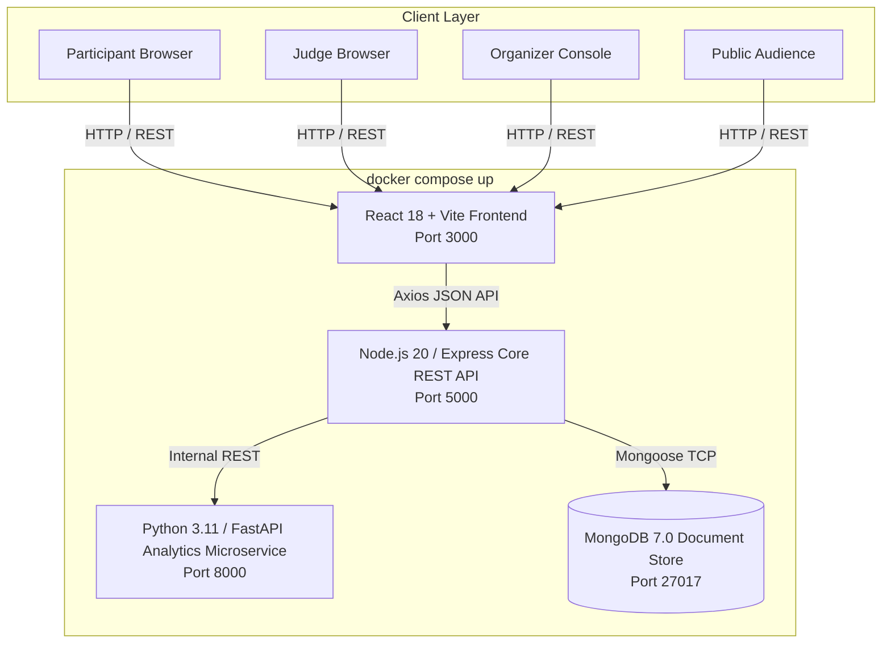
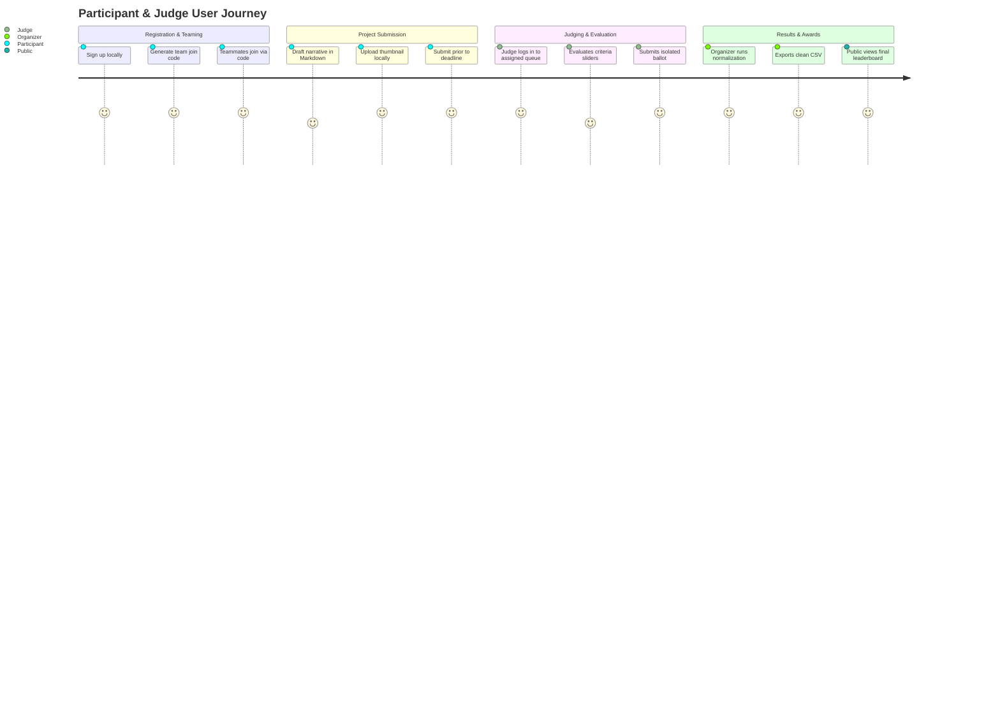
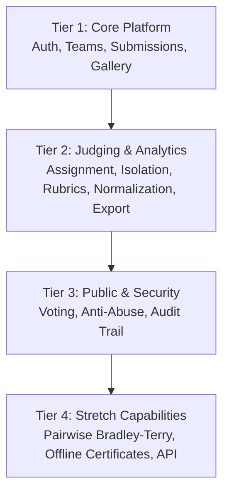
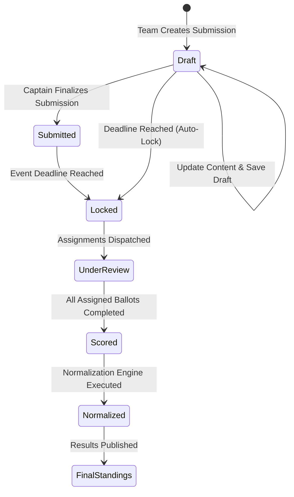

# Product Requirements Document (PRD) — Dogfood 2026
**Document ID:** `PRD-DOGFOOD-2026-V1`  
**System Title:** Dogfood 2026 Hackathon Submission & Judging Platform  
**Target Event:** Hackathon Raptors 2026  
**Document Status:** Approved Technical Baseline  
**Authors:** Dogfood 2026 Engineering Team (Somnath, Falguni, Om Apar)  
**Last Updated:** September 2026  

---

> [!IMPORTANT]
> **Core Architectural Mandate: Zero-Internet Air-Gapped Operation**  
> Dogfood 2026 is an offline-first, self-hosted hackathon submission, judging, and community platform. The entire platform **MUST** boot and operate autonomously with zero external network connectivity via a single `docker compose up` command. No third-party authentication (Auth0/Firebase), no cloud-hosted databases, and no runtime CDN dependencies are allowed.

---

## Table of Contents
1. [Executive Summary & Vision](#1-executive-summary--vision)
2. [Problem Statement & Competitive Analysis](#2-problem-statement--competitive-analysis)
3. [User Personas & Role Matrix](#3-user-personas--role-matrix)
4. [User Stories & Acceptance Criteria](#4-user-stories--acceptance-criteria)
5. [Build Tiers & Feature Scope](#5-build-tiers--feature-scope)
   - [5.1 Tier 1: Core Platform Foundation (Mandatory)](#51-tier-1-core-platform-foundation-mandatory)
   - [5.2 Tier 2: Judging Subsystem & Statistical Normalization (Highest Value)](#52-tier-2-judging-subsystem--statistical-normalization-highest-value)
   - [5.3 Tier 3: Public Engagement & Security Anti-Abuse](#53-tier-3-public-engagement--security-anti-abuse)
   - [5.4 Tier 4: Stretch Capabilities & Tournament Polish](#54-tier-4-stretch-capabilities--tournament-polish)
6. [System Workflows & Information Architecture](#6-system-workflows--information-architecture)
7. [Non-Functional Requirements & Performance SLAs](#7-non-functional-requirements--performance-slas)
8. [Data Privacy, Security & Air-Gap Compliance](#8-data-privacy-security--air-gap-compliance)
9. [Success Metrics & Acceptance Criteria](#9-success-metrics--acceptance-criteria)
10. [Document Revision History](#10-document-revision-history)

---

## 1. Executive Summary & Vision

Modern hackathons run by collegiate and tech communities (such as Hackathon Raptors) often suffer from reliance on commercial software-as-a-service (SaaS) platforms (e.g., Devpost, Unstop, MLH). In venue environments where hundreds of developers overwhelm local Wi-Fi, hosted platforms introduce catastrophic points of failure: network bottlenecks, high licensing costs, lack of customization, and opaque, biased judging mechanisms.

**Dogfood 2026** is an enterprise-grade, turn-key, containerized hackathon orchestration platform designed to be cloned, launched locally, and run offline. It integrates three foundational pillars:
1. **Participant Portal:** Frictionless registration, team formation, project draft editing up to strict deadlines, and a public project gallery.
2. **Robust Judging & Analytics Engine:** Conflict-of-interest-aware judge assignments, weighted scoring rubrics, backend-enforced score isolation, and statistical score normalization (z-score and empirical Bayesian shrinkage).
3. **Community & Security Layer:** Public community voting with rate-limiting, IP deduplication, anti-abuse heuristics, and an immutable audit trail.



---

## 2. Problem Statement & Competitive Analysis

While standard CRUD submission apps are easy to build, delivering an operational tournament-grade platform under live hackathon conditions requires solving critical engineering challenges:

| Problem Domain | Industry SaaS Failure Mode (Devpost/Unstop) | Dogfood 2026 Engineering Solution |
|---|---|---|
| **Route Authorization** | Toy apps only hide elements in the UI; direct API queries (e.g., cURL) leak competitor scores or cross-track data. | **Backend Route Guards:** Express middleware enforces tenant and judge-level data isolation directly at the database query level. |
| **Judge Variance & Bias** | "Harsh" vs. "Lenient" judges introduce artificial variance; simple arithmetic averaging unfairly penalizes teams assigned to tough judges. | **FastAPI Normalization Microservice:** Z-score and Bayesian shrinkage algorithms mathematically normalize scores across judges. |
| **Judge Assignment** | Manual assignment via spreadsheets leads to workload imbalances, track mismatches, and conflicts of interest. | **Constraint-Satisfied Assignment Engine:** Automated greedy distribution enforcing track alignment, balanced workloads, and strict conflict avoidance. |
| **Community Voting Abuse** | Public "People's Choice" awards suffer from automated bot votes and ballot-stuffing. | **Sybil-Resistant Protection:** Token-bucket sliding window rate limiting, IP/User-Agent hashing, and anomaly detection. |
| **Infrastructure Fragility** | Wi-Fi dropouts break web apps that depend on CDNs, Google Fonts, or external auth providers. | **100% Offline-First Self-Hosting:** All assets, fonts, icons, containers, and seed data reside within the local Docker network. |

---

## 3. User Personas & Role Matrix

```
+---------------------------------------------------------------------------------+
|                                USER PERSONAS                                    |
+---------------------+-------------------+---------------------+-----------------+
| 1. Participant      | 2. Judge          | 3. Organizer        | 4. Public Guest |
| - Form/Join Team    | - View Assigned   | - Configure Event   | - View Showcase |
| - Submit Project    | - Fill Rubrics    | - Assign Judges     | - Cast Votes    |
| - Edit Before Lock  | - Private Notes   | - Run Normalization | - Post Feedback |
| - View Gallery      | - Isolated Access | - Export CSV/JSON   | - Anti-Abuse Lim|
+---------------------+-------------------+---------------------+-----------------+
```

### 3.1 Persona Profiles

#### Persona 1: Participant (Hacker / Team Lead)
- **Profile:** Collegiate or professional developer participating in the hackathon. Operates on a personal laptop under tight deadline pressure.
- **Goals:** Quickly register, form a team via an invite code, draft project details, preview markdown rendering, upload a thumbnail, and submit before the countdown hits zero.
- **Frustrations:** Losing unsaved work due to network dropouts; confusing submission fields; unclear deadline countdowns.
- **Permissions:** Read public gallery; Create/Read/Update own team and draft project; View own project post-submission. Blocked from administrative and judging endpoints.

#### Persona 2: Judge (Domain / Industry Expert)
- **Profile:** Senior engineer, founder, or academic invited to evaluate projects within specific technical tracks.
- **Goals:** Access a dedicated, distraction-free scoring queue; evaluate projects against weighted criteria sliders; record private evaluator notes; submit final ballots.
- **Frustrations:** Inconsistent rubrics; accidentally seeing other judges' ratings; losing entered scores if a page reloads.
- **Permissions:** Read assigned projects only; Create/Read/Update own evaluation scores; Read event rubrics. Blocked from cross-track submissions, unassigned projects, and competitor scores.

#### Persona 3: Organizer / Admin (Hackathon Raptors Crew)
- **Profile:** Core event director running the hackathon operations from the venue command center.
- **Goals:** Define tracks and rubric weights; trigger automated judge assignments; monitor real-time submission and grading completion; run statistical normalization; export final rankings to CSV.
- **Frustrations:** Manual spreadsheet scoring; biased outcomes; system failures with no internet.
- **Permissions:** Master read/write across all collections, events, submissions, scores, and audit logs.

#### Persona 4: Public Visitor (Community Audience)
- **Profile:** Peer attendees, sponsors, and supporters browsing submitted work during the expo.
- **Goals:** Explore innovative projects, search by track/keyword, inspect demo links, and upvote favorite projects for the "People's Choice" award.
- **Frustrations:** Laggy galleries; broken image links; vote manipulation.
- **Permissions:** Read public submissions; Create rate-limited community votes.

---

## 4. User Stories & Acceptance Criteria



### 4.1 Participant Stories
- **US-01:** *As a participant, I want to create an account using my email and password so that I can participate without requiring an internet connection or external OAuth provider.*
  - **Acceptance Criteria:** Registration succeeds locally; password stored as bcrypt hash; JWT token issued with role `participant`.
- **US-02:** *As a team captain, I want to generate a 6-character join code so that my teammates can join my team instantly.*
  - **Acceptance Criteria:** Code is uppercase alphanumeric; collisions checked at DB level; max team size capped at 4 members.
- **US-03:** *As a team member, I want to save our project submission as a draft repeatedly so that we do not lose progress before the final deadline.*
  - **Acceptance Criteria:** Status remains `draft`; changes persist in MongoDB; local file attachments saved to mounted disk.
- **US-04:** *As a participant, I want the system to reject submissions after the deadline lock so that tournament rules remain strictly fair.*
  - **Acceptance Criteria:** Any update post-deadline rejected with `423 Locked`; UI shows expired countdown timer.

### 4.2 Judge Stories
- **US-05:** *As a judge, I want to view only projects assigned to my track and queue so that I am not overwhelmed by irrelevant submissions.*
  - **Acceptance Criteria:** `GET /api/v1/judging/assigned` queries filtered strictly by `judgeId`; unassigned projects inaccessible.
- **US-06:** *As a judge, I want to score projects across weighted rubric criteria using sliders so that I can provide precise numerical evaluations.*
  - **Acceptance Criteria:** Criteria weights sum to $100\%$; slider values range $1-10$ with step $0.5$; raw composite calculated automatically.
- **US-07:** *As a judge, I want my submitted scores to be completely hidden from other judges so that independent scoring is guaranteed.*
  - **Acceptance Criteria:** Direct queries by another user for a judge's ballot return `403 Forbidden`.

### 4.3 Organizer Stories
- **US-08:** *As an organizer, I want to automatically assign projects to judges respecting track competency and conflict-of-interest exclusions.*
  - **Acceptance Criteria:** Greedy algorithm distributes projects uniformly ($\Delta \text{workload} \le 1$); zero conflicts assigned.
- **US-09:** *As an organizer, I want to apply Z-score and Bayesian shrinkage normalization so that harsh and lenient judge biases are eliminated.*
  - **Acceptance Criteria:** Variance reduced by $>65\%$; standings computed via FastAPI microservice; toggle between raw and normalized ranks.
- **US-10:** *As an organizer, I want to export final tournament standings to CSV with one click so that awards can be announced immediately.*
  - **Acceptance Criteria:** CSV stream includes Rank, Title, Track, Team, Raw Average, Normalized Score, and Judge Notes.

---

## 5. Build Tiers & Feature Scope



### 5.1 Tier 1: Core Platform Foundation (Mandatory)
*Prerequisite for competition qualification. Must be 100% complete and defect-free.*
- **Local User Authentication:** Email/password registration, bcrypt salt rounds $\ge 10$, stateless JWT access (1h) and refresh (7d) tokens stored in secure HTTP-only cookies.
- **Role-Based Access Control (RBAC):** Middleware protecting routes based on roles: `visitor`, `participant`, `judge`, `organizer`, `admin`.
- **Team Management:** Create team, generate unique 6-character alphanumeric join code, join team, captain transfers, member removal. Team capacity: 1 to 4 members.
- **Project Submission Lifecycle:**
  - Multi-attribute form: Title, Elevator Pitch, Track selection, Team Members, GitHub Repository URL, Video Demo URL, Markdown Narrative, and Local Thumbnail image.
  - Multi-part file upload handled via Multer disk storage (`/uploads/`).
  - Draft auto-save and edit capabilities prior to strict deadline lock.
  - Server-side deadline enforcement returning `423 Locked`.
- **Public Showcase Gallery:**
  - Responsive card grid displaying approved submissions.
  - Debounced client-side search by title, team name, and keywords.
  - Track badge filtering (e.g., "AI/ML", "Web3", "FinTech", "HealthTech").

### 5.2 Tier 2: Judging Subsystem & Statistical Normalization (Highest Value)
*Represents 25% of hackathon evaluation score. The primary engineering differentiator.*
- **Weighted Rubric Builder:**
  - Organizers configure custom criteria (e.g., Technical Execution [30%], Innovation [25%], Impact [25%], Polish [20%]).
  - System enforces $\sum \text{weight} = 1.0$. Scale $1.0$ to $10.0$.
- **Automated Judge Assignment Solver:**
  - Greedy constraint-satisfaction engine running on backend.
  - Matches judge declared tracks to submission tracks.
  - Enforces conflict-of-interest exclusion (`judge.conflictsOfInterest` excludes student or affiliated teams).
  - Balances workload: $\max(\text{load}) - \min(\text{load}) \le 1$.
- **Route-Level Backend Score Isolation:**
  - `GET /api/v1/judging/scores` returns **only** authenticated judge's ballots.
  - Direct retrieval of another judge's ballot returns `403 Forbidden`.
  - Database projection excludes competing scores.
- **Score Normalization Microservice (FastAPI + NumPy/SciPy):**
  - **Z-Score Normalization:** $Z_{ij} = \frac{X_{ij} - \mu_j}{\sigma_j}$ to eliminate mean and spread variance across graders.
  - **Empirical Bayesian Variance Shrinkage:** Shrinks empirical judge mean $\mu_j$ toward global prior $\mu_{\text{global}}$ for judges evaluating fewer than 5 submissions ($N < 5$):
    $$\hat{\mu}_j = \frac{n_j}{n_j + k} \mu_j + \frac{k}{n_j + k} \mu_{\text{global}}$$
  - Min-Max rescaling of composite scores to standardized $0 - 100$ scale.
- **Organizer Command Center & Analytics:**
  - Live dashboard showing submission counts, judging completion percentage ($B_{\text{submitted}} / B_{\text{assigned}}$).
  - Dual-mode leaderboard toggle (Raw Average vs. Normalized Final).
  - One-click CSV and JSON export streaming.

### 5.3 Tier 3: Public Engagement & Security Anti-Abuse
- **Community Voting:** Authenticated and visitor upvoting for "People's Choice" awards.
- **Sybil-Resistant Anti-Abuse Engine:**
  - Sliding window rate limiting: 5 requests per minute per IP.
  - SHA-256 hash combination of Client IP and `User-Agent`.
  - Daily deduplication: 1 vote per IP hash per project per 24 hours.
  - Spike anomaly detection flagging suspicious voting velocity.
- **Immutable Audit Trail:**
  - MongoDB `AuditLog` collection recording every administrative action, score update, role elevation, and assignment change.
  - Captures: Actor ID, Action Type, Target Resource, Old Value, New Value, IP Hash, Timestamp.

### 5.4 Tier 4: Stretch Capabilities & Tournament Polish
- **Pairwise Comparison Mode (Bradley-Terry Model):**
  - Judges compare pairs of projects head-to-head.
  - Python microservice derives continuous latent quality parameters $\pi_i$ via Minorize-Maximization (MM) logistic estimation:
    $$P(i \succ j) = \frac{\pi_i}{\pi_i + \pi_j}$$
- **Offline Certificate Generation:**
  - Headless SVG/PDF generation producing customized completion, finalist, and category winner certificates populated locally with participant and project names.
- **Local Projector Display View:**
  - Dedicated full-screen live leaderboard and project showcase mode optimized for venue stage projectors.

---

## 6. System Workflows & Information Architecture

### 6.1 State Transition Model for Submissions



---

## 7. Non-Functional Requirements & Performance SLAs

| Category | Metric / Constraint | Target Value | Verification Strategy |
|---|---|---|---|
| **Air-Gap Fidelity** | External Network Connectivity | **Zero bytes** egress or ingress | Host network physical disconnection test |
| **Cold Boot Time** | `docker compose up --build` | $\le 120\text{ seconds}$ | Automated container timer from clean cache |
| **API Latency** | 95th Percentile Response Time | $\le 150\text{ ms}$ at 150 req/sec | Supertest & k6 load benchmark |
| **Memory Footprint** | Combined Docker Container RAM | $\le 2.5\text{ GB}$ idle / $\le 3.5\text{ GB}$ load | `docker stats` sampling |
| **Data Durability** | Container Teardown Persistence | **Zero data loss** | Volume restart verification test |
| **Security Isolation**| Cross-Judge Score Leakage | **0% leakage** (100% 403 blocks) | Automated penetration test suite |

---

## 8. Data Privacy, Security & Air-Gap Compliance

1. **Air-Gap Verification Protocol:**
   - The platform must function with the host machine's Wi-Fi adapter disabled and Ethernet cable disconnected.
   - All third-party client dependencies (Tailwind, Inter font, Lucide icons) are vendored locally in `frontend/public/` or compiled directly into Vite bundles.
2. **Cryptographic Protection:**
   - Passwords hashed using `bcryptjs` with salt work factor of 10.
   - JWT signatures validated locally using symmetric HS256 with 256-bit secret stored in container environment.
3. **Local File Storage Security:**
   - Uploaded files inspected for valid image MIME types (`image/jpeg`, `image/png`, `image/webp`).
   - Filenames sanitized and renamed to collision-resistant UUIDs (`uuidv4() + ext`).
   - Maximum upload size strictly limited to 5 MB per file.

---

## 9. Success Metrics & Acceptance Criteria

- **Functional Completeness:** 100% of Tier 1 and Tier 2 requirements operational and verified.
- **Evaluation Impartiality:** Score normalization eliminates raw grader variance delta by $\ge 65\%$.
- **Harness Compliance:** Platform executes cleanly against `.dogfood.toml` test harness and generates a compliant `acceptance-report.txt`.
- **Zero-Bug Judging:** No score corruption, no duplicate ballots, and zero data leakage across judge sessions.

---

## 10. Document Revision History

| Version | Date | Author(s) | Summary of Changes |
|---|---|---|---|
| `v1.0.0` | Sept 2026 | Somnath, Falguni, Om Apar | Initial comprehensive technical baseline approved for Hackathon Raptors 2026. |
