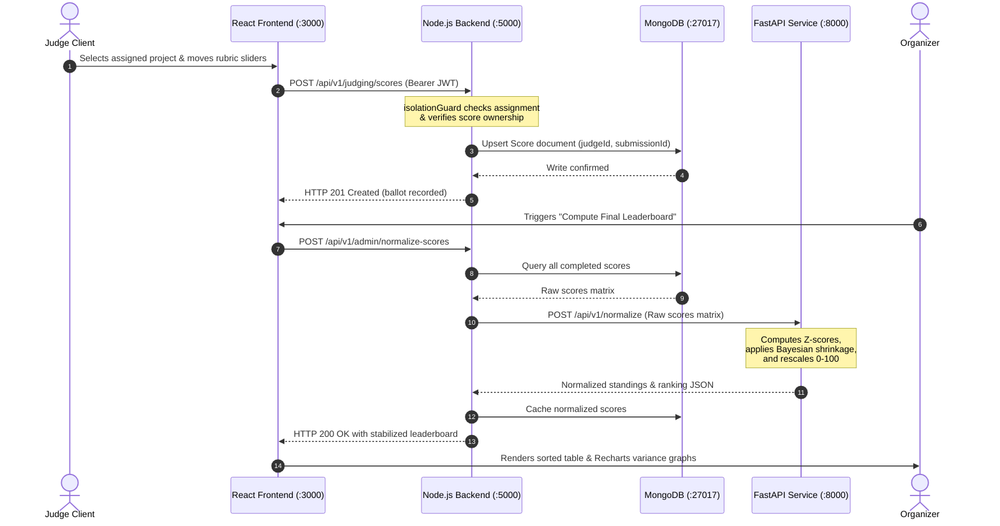

# Software Design Document (SDD) — Dogfood 2026
**Document ID:** `SDD-DOGFOOD-2026-V1`  
**System Title:** Dogfood 2026 Hackathon Submission & Judging Platform  
**Target Event:** Hackathon Raptors 2026  
**Authors:** Dogfood 2026 Engineering Team (Somnath, Falguni, Om Apar)  
**Status:** Approved Technical Architecture  

---

> [!NOTE]
> **Architectural Paradigm: Dual-Service Hybrid Engine**  
> Dogfood 2026 decouples transactional workloads from statistical computation:
> - **Node.js/Express Core:** Owns user authentication, relational integrity in document collections, file storage, submission status lifecycles, and route guarding.
> - **Python/FastAPI Analytics Microservice:** Dedicated high-performance worker executing NumPy/SciPy statistical score normalization, Empirical Bayesian shrinkage, Bradley-Terry logistic estimation, and voting anomaly heuristics.

---

## Table of Contents
1. [Architectural Overview & Microservice Topology](#1-architectural-overview--microservice-topology)
2. [Component Directory Structure](#2-component-directory-structure)
3. [Database Architecture & Mongoose Schemas](#3-database-architecture--mongoose-schemas)
   - [3.1 User Schema (`User.js`)](#31-user-schema-userjs)
   - [3.2 Team Schema (`Team.js`)](#32-team-schema-teamjs)
   - [3.3 Submission Schema (`Submission.js`)](#33-submission-schema-submissionjs)
   - [3.4 Rubric & Score Schemas (`Score.js`)](#34-rubric--score-schemas-scorejs)
   - [3.5 JudgeAssignment Schema (`JudgeAssignment.js`)](#35-judgeassignment-schema-judgeassignmentjs)
   - [3.6 Community Vote Schema (`Vote.js`)](#36-community-vote-schema-votejs)
   - [3.7 Immutable Audit Log Schema (`AuditLog.js`)](#37-immutable-audit-log-schema-auditlogjs)
4. [Python FastAPI Pydantic Models](#4-python-fastapi-pydantic-models)
5. [Algorithmic Specifications & Mathematical Formulations](#5-algorithmic-specifications--mathematical-formulations)
   - [5.1 Statistical Score Normalization (Z-Score + Bayesian Shrinkage)](#51-statistical-score-normalization-z-score--bayesian-shrinkage)
   - [5.2 Numerical Worked Example: Normalization in Action](#52-numerical-worked-example-normalization-in-action)
   - [5.3 Bradley-Terry Pairwise Evaluation Model (Minorize-Maximization)](#53-bradley-terry-pairwise-evaluation-model-minorize-maximization)
   - [5.4 Greedy Constraint-Satisfied Judge Assignment Engine](#54-greedy-constraint-satisfied-judge-assignment-engine)
   - [5.5 Sybil-Resistant Anti-Abuse Heuristics](#55-sybil-resistant-anti-abuse-heuristics)
6. [Comprehensive REST API Catalog](#6-comprehensive-rest-api-catalog)
7. [Security & Route Isolation Architecture](#7-security--route-isolation-architecture)
   - [7.1 Authentication & Token Middleware](#71-authentication--token-middleware)
   - [7.2 Role Guard Middleware](#72-role-guard-middleware)
   - [7.3 Route-Level Score & Queue Isolation Guard](#73-route-level-score--queue-isolation-guard)
8. [Document Revision History](#8-document-revision-history)

---

## 1. Architectural Overview & Microservice Topology

The platform architecture is designed around four containerized services interconnected over an isolated Docker bridge network (`dogfood-net`).

```
+-----------------------------------------------------------------------------------+
|                                  DOCKER HOST                                      |
|                                                                                   |
|   Port 3000 (Ingress)                                      Port 5000 (Ingress)    |
|          |                                                          |             |
|   +------v---------------------+                            +-------v---------+   |
|   |         frontend           |         REST API           |       api       |   |
|   |  React 18 + Vite + Tailwind|  =======================>  |  Node 20 + MERN |   |
|   |  Client Routing & State    |                            |  Auth & Storage |   |
|   +----------------------------+                            +---+---------+---+   |
|                                                                 |         |       |
|                                           Mongoose / TCP 27017  |         |       |
|                                    +----------------------------+         |       |
|                                    |                                      |       |
|                           +--------v---------+                            |       |
|                           |     mongodb      |                            |       |
|                           |   MongoDB 7.0    |                            |       |
|                           | Persistent Vol   |                            |       |
|                           +------------------+                            |       |
|                                                                           |       |
|                                              Internal HTTP / TCP 8000     |       |
|                                    +--------------------------------------+       |
|                                    |                                              |
|                           +--------v-------------+                                |
|                           |   judging-service    |                                |
|                           | Python 3.11 + FastAPI|                                |
|                           | NumPy / SciPy Engine |                                |
|                           +----------------------+                                |
+-----------------------------------------------------------------------------------+
```

### 1.1 Interservice Data Flow



---

## 2. Component Directory Structure

```text
dogfood-2026/
├── docker-compose.yml          # Unified multi-container orchestration
├── .env.example                # Local environmental variables template
├── .dogfood.toml               # Hackathon test harness specification
├── README.md                   # Operational quickstart guide
├── acceptance-report.txt       # Automated qualification report
│
├── frontend/                   # React 18 SPA (Falguni - Frontend Lead)
│   ├── public/
│   │   ├── fonts/              # Vendored Inter and JetBrains Mono fonts (offline)
│   │   └── favicon.ico
│   ├── src/
│   │   ├── assets/             # Logos, offline badge icons
│   │   ├── components/         # Navbar, ProjectCard, RubricSlider, Modal, LeaderboardTable
│   │   ├── context/            # AuthContext, NotificationContext
│   │   ├── hooks/              # useAuth, useSubmissions, useJudging, useTimer
│   │   ├── pages/              # Home, Gallery, TeamDashboard, SubmissionEditor, JudgePortal, AdminDashboard
│   │   ├── services/           # api.js (Axios instance configured for http://localhost:5000)
│   │   ├── utils/              # markdownSanitizer.js, formatters.js
│   │   ├── App.jsx             # React Router v6 route configuration
│   │   ├── index.css           # Tailwind base styles and CSS variables
│   │   └── main.jsx            # Entry point
│   ├── Dockerfile              # Multi-stage build with Nginx reverse proxy
│   ├── package.json
│   ├── vite.config.js
│   └── tailwind.config.js
│
├── backend/                    # Node.js Express REST Core (Somnath - Backend Lead)
│   ├── src/
│   │   ├── config/             # db.js (Mongoose connect), jwt.js, multer.js
│   │   ├── controllers/        # authController.js, teamController.js, submissionController.js,
│   │   │                       # judgingController.js, adminController.js, voteController.js
│   │   ├── middleware/         # authMiddleware.js, roleGuard.js, isolationGuard.js,
│   │   │                       # rateLimiter.js, errorMiddleware.js
│   │   ├── models/             # User.js, Team.js, Submission.js, Score.js,
│   │   │                       # JudgeAssignment.js, Vote.js, AuditLog.js, Event.js
│   │   ├── routes/             # authRoutes.js, teamRoutes.js, submissionRoutes.js,
│   │   │                       # judgingRoutes.js, adminRoutes.js, voteRoutes.js
│   │   ├── services/           # assignmentSolver.js, fastApiClient.js, csvExporter.js
│   │   └── index.js            # Express application bootstrap & server listener
│   ├── uploads/                # Local host-mounted directory for project thumbnails
│   ├── Dockerfile              # Node.js 20 Alpine lightweight container
│   ├── package.json
│   └── tests/                  # Jest & Supertest integration test suite
│
├── judging-service/            # Python 3.11 FastAPI Analytics Engine (Om Apar - ML Lead)
│   ├── app/
│   │   ├── algorithms/
│   │   │   ├── normalization.py    # Z-score and Empirical Bayesian shrinkage engine
│   │   │   ├── pairwise.py         # Bradley-Terry Minorize-Maximization (MM) estimator
│   │   │   └── anomaly_detector.py # Voting velocity and entropy classifier
│   │   ├── models/                 # schemas.py (Pydantic models for REST payloads)
│   │   ├── routes/                 # normalize.py, pairwise.py, health.py
│   │   └── main.py                 # FastAPI ASGI entrypoint
│   ├── tests/                      # Pytest mathematical verification suite
│   ├── Dockerfile                  # Python 3.11 Slim container
│   └── requirements.txt            # fastapi, uvicorn, numpy, scipy, pandas, pydantic
│
└── seed/                       # Fixture data & MongoDB initialization scripts
    └── init-mongo.js           # Automated seed data for tournament instant boot
```

---

## 3. Database Architecture & Mongoose Schemas

All entities are modeled in Mongoose with strict schema validation, type constraints, and compound indexing.

### 3.1 User Schema (`backend/src/models/User.js`)
```javascript
const mongoose = require('mongoose');

const UserSchema = new mongoose.Schema({
  email: { 
    type: String, 
    required: [true, 'Email is required'], 
    unique: true, 
    trim: true, 
    lowercase: true,
    index: true 
  },
  passwordHash: { 
    type: String, 
    required: [true, 'Password hash is required'], 
    select: false // Never exposed in default projections
  },
  fullName: { type: String, required: true, trim: true },
  role: { 
    type: String, 
    enum: ['visitor', 'participant', 'judge', 'organizer', 'admin'], 
    default: 'participant',
    index: true 
  },
  teamId: { 
    type: mongoose.Schema.Types.ObjectId, 
    ref: 'Team', 
    default: null 
  },
  judgeTracks: [{ 
    type: String 
  }], // e.g. ['AI/ML', 'FinTech']
  conflictsOfInterest: [{ 
    type: mongoose.Schema.Types.ObjectId, 
    ref: 'Team' 
  }] // Teams the judge is prohibited from scoring
}, { 
  timestamps: true 
});

module.exports = mongoose.model('User', UserSchema);
```

### 3.2 Team Schema (`backend/src/models/Team.js`)
```javascript
const mongoose = require('mongoose');

const TeamSchema = new mongoose.Schema({
  name: { 
    type: String, 
    required: [true, 'Team name is required'], 
    unique: true, 
    trim: true,
    minlength: [3, 'Team name must be at least 3 characters'],
    maxlength: [40, 'Team name cannot exceed 40 characters']
  },
  joinCode: { 
    type: String, 
    required: true, 
    unique: true, 
    uppercase: true, 
    length: 6,
    index: true 
  },
  captainId: { 
    type: mongoose.Schema.Types.ObjectId, 
    ref: 'User', 
    required: true 
  },
  members: [{ 
    type: mongoose.Schema.Types.ObjectId, 
    ref: 'User' 
  }],
  track: { 
    type: String, 
    required: [true, 'Competition track is required'],
    index: true
  },
  hasSubmitted: { 
    type: Boolean, 
    default: false 
  }
}, { 
  timestamps: true 
});

// Enforce maximum team size of 4 members
TeamSchema.pre('save', function(next) {
  if (this.members.length > 4) {
    next(new Error('A team cannot exceed 4 members.'));
  } else {
    next();
  }
});

module.exports = mongoose.model('Team', TeamSchema);
```

### 3.3 Submission Schema (`backend/src/models/Submission.js`)
```javascript
const mongoose = require('mongoose');

const SubmissionSchema = new mongoose.Schema({
  teamId: { 
    type: mongoose.Schema.Types.ObjectId, 
    ref: 'Team', 
    required: true, 
    unique: true, 
    index: true 
  },
  title: { 
    type: String, 
    required: true, 
    trim: true, 
    maxlength: 120 
  },
  tagline: { 
    type: String, 
    required: true, 
    trim: true, 
    maxlength: 250 
  },
  track: { 
    type: String, 
    required: true, 
    index: true 
  },
  repoUrl: { 
    type: String, 
    required: true,
    trim: true 
  },
  demoUrl: { 
    type: String, 
    default: '', 
    trim: true 
  },
  descriptionMarkdown: { 
    type: String, 
    required: true 
  },
  thumbnailPath: { 
    type: String, 
    default: '/uploads/default-thumbnail.webp' 
  },
  status: { 
    type: String, 
    enum: ['draft', 'submitted', 'locked'], 
    default: 'draft',
    index: true 
  },
  publicVoteCount: { 
    type: Number, 
    default: 0, 
    index: true 
  },
  submittedAt: { 
    type: Date, 
    default: null 
  }
}, { 
  timestamps: true 
});

// Full-text search index for public gallery
SubmissionSchema.index({ title: 'text', tagline: 'text' });

module.exports = mongoose.model('Submission', SubmissionSchema);
```

### 3.4 Rubric & Score Schemas (`backend/src/models/Score.js`)
```javascript
const mongoose = require('mongoose');

const CriterionScoreSchema = new mongoose.Schema({
  criteriaName: { type: String, required: true },
  weight: { type: Number, required: true, min: 0.05, max: 0.8 },
  rawScore: { type: Number, required: true, min: 1.0, max: 10.0 }
}, { _id: false });

const ScoreSchema = new mongoose.Schema({
  judgeId: { 
    type: mongoose.Schema.Types.ObjectId, 
    ref: 'User', 
    required: true, 
    index: true 
  },
  submissionId: { 
    type: mongoose.Schema.Types.ObjectId, 
    ref: 'Submission', 
    required: true, 
    index: true 
  },
  criteriaScores: [CriterionScoreSchema],
  totalRawScore: { 
    type: Number, 
    required: true, 
    min: 1.0, 
    max: 10.0 
  },
  normalizedScore: { 
    type: Number, 
    default: null 
  },
  privateNotes: { 
    type: String, 
    default: '', 
    maxlength: 2000 
  },
  isFinal: { 
    type: Boolean, 
    default: true 
  }
}, { 
  timestamps: true 
});

// Compound unique index: Each judge can submit exactly ONE score per submission
ScoreSchema.index({ judgeId: 1, submissionId: 1 }, { unique: true });

module.exports = mongoose.model('Score', ScoreSchema);
```

### 3.5 JudgeAssignment Schema (`backend/src/models/JudgeAssignment.js`)
```javascript
const mongoose = require('mongoose');

const JudgeAssignmentSchema = new mongoose.Schema({
  judgeId: { 
    type: mongoose.Schema.Types.ObjectId, 
    ref: 'User', 
    required: true, 
    index: true 
  },
  submissionId: { 
    type: mongoose.Schema.Types.ObjectId, 
    ref: 'Submission', 
    required: true, 
    index: true 
  },
  track: { 
    type: String, 
    required: true 
  },
  status: { 
    type: String, 
    enum: ['pending', 'completed'], 
    default: 'pending',
    index: true 
  }
}, { 
  timestamps: true 
});

JudgeAssignmentSchema.index({ judgeId: 1, submissionId: 1 }, { unique: true });

module.exports = mongoose.model('JudgeAssignment', JudgeAssignmentSchema);
```

### 3.6 Community Vote Schema (`backend/src/models/Vote.js`)
```javascript
const mongoose = require('mongoose');

const VoteSchema = new mongoose.Schema({
  submissionId: { 
    type: mongoose.Schema.Types.ObjectId, 
    ref: 'Submission', 
    required: true, 
    index: true 
  },
  fingerprintHash: { 
    type: String, 
    required: true, 
    index: true 
  },
  ipAddress: { type: String, select: false },
  createdAt: { 
    type: Date, 
    default: Date.now,
    expires: 86400 // TTL Index: Automatic expiration after 24 hours
  }
}, { 
  timestamps: false 
});

// Anti-Sybil Compound Index: 1 vote per fingerprint per submission per 24 hours
VoteSchema.index({ submissionId: 1, fingerprintHash: 1 }, { unique: true });

module.exports = mongoose.model('Vote', VoteSchema);
```

### 3.7 Immutable Audit Log Schema (`backend/src/models/AuditLog.js`)
```javascript
const mongoose = require('mongoose');

const AuditLogSchema = new mongoose.Schema({
  actorId: { type: mongoose.Schema.Types.ObjectId, ref: 'User', required: true },
  actorRole: { type: String, required: true },
  action: { 
    type: String, 
    enum: [
      'SUBMISSION_LOCKED', 
      'SCORE_SUBMITTED', 
      'SCORE_OVERRIDDEN', 
      'JUDGES_ASSIGNED', 
      'NORMALIZATION_EXECUTED', 
      'RUBRIC_MODIFIED'
    ], 
    required: true,
    index: true
  },
  targetResource: { type: String, required: true },
  resourceId: { type: mongoose.Schema.Types.ObjectId, required: true },
  payload: { type: mongoose.Schema.Types.Mixed, default: {} },
  ipHash: { type: String, required: true },
  timestamp: { type: Date, default: Date.now, index: true }
}, { 
  timestamps: false,
  capped: false // Persistent storage
});

module.exports = mongoose.model('AuditLog', AuditLogSchema);
```

---

## 4. Python FastAPI Pydantic Models

Located in `judging-service/app/models/schemas.py`:

```python
from pydantic import BaseModel, Field
from typing import List, Optional

class JudgeScoreEntry(BaseModel):
    judge_id: str = Field(..., description="Unique judge identifier")
    submission_id: str = Field(..., description="Unique project submission identifier")
    raw_composite_score: float = Field(..., ge=1.0, le=10.0, description="Raw weighted score")

class NormalizationRequest(BaseModel):
    event_id: str
    scores: List[JudgeScoreEntry]
    bayesian_prior_k: float = Field(default=3.0, ge=1.0, le=10.0)

class ProjectStanding(BaseModel):
    submission_id: str
    raw_mean: float
    normalized_score: float = Field(..., ge=0.0, le=100.0)
    z_score_mean: float
    ballot_count: int
    rank: int

class JudgeCalibrationMetric(BaseModel):
    judge_id: str
    sample_size: int
    raw_mean: float
    raw_std: float
    bayesian_shrunk_mean: float

class NormalizationResponse(BaseModel):
    status: str
    algorithm: str
    total_submissions: int
    total_scores_processed: int
    judge_calibrations: List[JudgeCalibrationMetric]
    standings: List[ProjectStanding]

class PairwiseComparison(BaseModel):
    submission_a: str
    submission_b: str
    winner: str # submission_a or submission_b

class PairwiseRankRequest(BaseModel):
    comparisons: List[PairwiseComparison]
    max_iterations: int = 100
    tolerance: float = 1e-6

class PairwiseRankResponse(BaseModel):
    standings: List[dict] # { submission_id, latent_score, rank }
```

---

## 5. Algorithmic Specifications & Mathematical Formulations

### 5.1 Statistical Score Normalization (Z-Score + Bayesian Shrinkage)

The algorithm resolves evaluator bias through a 3-step pipeline:

```
[Raw Ballots Matrix]
        │
        ▼
1. Compute Per-Judge Statistics: μ_j, σ_j
        │
        ▼
2. Sample Size Condition:
   ├── If n_j >= 5: Standard Z-Score
   │   Z_ij = (X_ij - μ_j) / σ_j
   └── If n_j < 5:  Empirical Bayesian Shrinkage
       μ̂_j = (n_j / (n_j + k))*μ_j + (k / (n_j + k))*μ_global
       Z_ij = (X_ij - μ̂_j) / σ_j
        │
        ▼
3. Aggregate per Project: S_i = (1 / M_i) * Σ Z_ij
        │
        ▼
4. Rescale to 0-100: FinalScore_i = 100 * (S_i - min(S)) / (max(S) - min(S) + ε)
```

#### Step 1: Per-Judge Parameters
For each judge $j$ who scored $n_j$ projects:
$$\mu_j = \frac{1}{n_j} \sum_{i=1}^{n_j} X_{ij}$$
$$\sigma_j = \sqrt{\frac{1}{n_j} \sum_{i=1}^{n_j} (X_{ij} - \mu_j)^2 + \epsilon}$$
where $\epsilon = 10^{-6}$ prevents zero-division in case of identical scoring.

#### Step 2: Empirical Bayesian Shrinkage for Small Samples ($n_j < 5$)
When a judge evaluates only 2 or 3 projects, their empirical mean $\mu_j$ is volatile. We shrink $\mu_j$ toward the global population mean $\mu_{\text{global}}$:
$$\mu_{\text{global}} = \frac{1}{N_{\text{total}}} \sum_{j} \sum_{i} X_{ij}$$
$$\hat{\mu}_j = \left( \frac{n_j}{n_j + k} \right) \mu_j + \left( \frac{k}{n_j + k} \right) \mu_{\text{global}}$$
where $k = 3.0$ acts as a pseudo-count prior.

#### Step 3: Composite Z-Score Aggregation & Rescaling
$$S_i = \frac{1}{M_i} \sum_{j=1}^{M_i} \left( \frac{X_{ij} - \hat{\mu}_j}{\sigma_j} \right)$$
$$\text{FinalScore}_i = 100 \times \left( \frac{S_i - \min(S)}{\max(S) - \min(S) + \epsilon} \right)$$

---

### 5.2 Numerical Worked Example: Normalization in Action

Consider 2 Judges and 4 Projects:
- **Judge A (Tough Grader):** Scores projects with $\mu_A = 4.0, \sigma_A = 1.0$.
  - Project 1: Raw 5.0 $\rightarrow Z_{1A} = \frac{5.0 - 4.0}{1.0} = +1.0$
  - Project 2: Raw 3.0 $\rightarrow Z_{2A} = \frac{3.0 - 4.0}{1.0} = -1.0$
- **Judge B (Lenient Grader):** Scores projects with $\mu_B = 8.5, \sigma_B = 0.5$.
  - Project 3: Raw 9.0 $\rightarrow Z_{3B} = \frac{9.0 - 8.5}{0.5} = +1.0$
  - Project 4: Raw 8.0 $\rightarrow Z_{4B} = \frac{8.0 - 8.5}{0.5} = -1.0$

**Under Raw Scoring:**  
Project 4 (Raw 8.0) would drastically beat Project 1 (Raw 5.0) purely because Judge B was generous!  

**Under Dogfood 2026 Normalization:**  
Both Project 1 and Project 3 achieve $Z = +1.0$. Both Project 2 and Project 4 achieve $Z = -1.0$. The unfair evaluator severity discrepancy is completely neutralized.

---

### 5.3 Bradley-Terry Pairwise Evaluation Model (Minorize-Maximization)

For Pairwise mode, probability of project $i$ beating project $j$ is parameterized by continuous latent skills $\pi_i, \pi_j > 0$:
$$P(i \succ j) = \frac{\pi_i}{\pi_i + \pi_j}$$

The log-likelihood of all observed comparisons is:
$$\ln L(\vec{\pi}) = \sum_{i < j} \left[ W_{ij} \ln \pi_i + W_{ji} \ln \pi_j - N_{ij} \ln(\pi_i + \pi_j) \right]$$

Iterative Minorize-Maximization (MM) update formula:
$$\pi_i^{(t+1)} = \frac{W_i}{\sum_{j \neq i} \frac{N_{ij}}{\pi_i^{(t)} + \pi_j^{(t)}}}$$
where:
- $W_i$ is total head-to-head wins for project $i$.
- $N_{ij} = W_{ij} + W_{ji}$ is total comparisons between $i$ and $j$.
- Vector $\vec{\pi}$ is normalized at each step such that $\sum_{i} \pi_i = 1.0$. Convergence checked when $|\vec{\pi}^{(t+1)} - \vec{\pi}^{(t)}\|_\infty < 10^{-6}$.

---

### 5.4 Greedy Constraint-Satisfied Judge Assignment Engine

Implemented in `backend/src/services/assignmentSolver.js`:

```text
ALGORITHM: GreedyJudgeAssignment(Submissions, Judges, TargetEvaluationsPerProject = 3)
1. Initialize AssignmentMap = {}
2. Initialize JudgeLoad = { judge_id: 0 for judge in Judges }

3. FOR EACH submission IN Submissions:
     eligible_judges = []
     FOR EACH judge IN Judges:
       IF submission.track IN judge.judgeTracks:
         IF submission.teamId NOT IN judge.conflictsOfInterest:
           eligible_judges.append(judge)
     
     IF length(eligible_judges) < TargetEvaluationsPerProject:
       RAISE InsufficientJudgesException("Track: " + submission.track)
     
     // Sort eligible judges ascending by current assigned load
     SORT eligible_judges BY JudgeLoad[judge._id] ASCENDING
     
     selected = eligible_judges[0 : TargetEvaluationsPerProject]
     FOR EACH selected_judge IN selected:
       CREATE JudgeAssignment(selected_judge._id, submission._id, submission.track)
       JudgeLoad[selected_judge._id] += 1

4. VERIFY WORKLOAD:
     max_load = MAX(JudgeLoad.values())
     min_load = MIN(JudgeLoad.values())
     ASSERT (max_load - min_load) <= 1
5. RETURN assignments
```

---

### 5.5 Sybil-Resistant Anti-Abuse Heuristics

1. **Sliding-Window Rate Limiter:**
   - 5 requests per 60-second window per IP.
2. **Fingerprint Hash Synthesis:**
   $$\text{Fingerprint} = \text{HMAC-SHA256}(\text{ClientIP} + \text{User-Agent}, \text{SecretKey})$$
3. **Database Uniqueness Guard:**
   `Vote.index({ submissionId: 1, fingerprintHash: 1 }, { unique: true })`
4. **Velocity Spike Anomaly Flag:**
   If $\frac{\Delta \text{Votes}}{\Delta t} > 15 \text{ votes/minute}$, submission is automatically flagged with `auditFlag: 'SUSPECT_VOTE_VELOCITY'` in the Organizer dashboard.

---

## 6. Comprehensive REST API Catalog

| HTTP | Endpoint | Access | Purpose | Success | Error Codes |
|---|---|---|---|---|---|
| `POST` | `/api/v1/auth/register` | Public | Register participant/judge | `201 Created` | `400, 409` |
| `POST` | `/api/v1/auth/login` | Public | Login; returns JWT cookie | `200 OK` | `400, 401` |
| `GET` | `/api/v1/auth/me` | Authenticated | Retrieve current session profile | `200 OK` | `401` |
| `POST` | `/api/v1/teams` | Participant | Create new team; generate 6-char code | `201 Created` | `400, 403` |
| `POST` | `/api/v1/teams/join` | Participant | Join team using 6-char code | `200 OK` | `400, 404` |
| `GET` | `/api/v1/teams/my-team`| Participant | Fetch roster, join code & submission | `200 OK` | `404` |
| `POST` | `/api/v1/submissions` | Participant | Create or update draft submission | `200/201` | `400, 423` |
| `POST` | `/api/v1/submissions/upload-thumbnail` | Participant | Multipart thumbnail file upload | `200 OK` | `413, 415` |
| `POST` | `/api/v1/submissions/finalize` | Participant | Lock submission for evaluation | `200 OK` | `400, 423` |
| `GET` | `/api/v1/submissions/gallery` | Public | Search and browse submitted projects | `200 OK` | - |
| `GET` | `/api/v1/judging/assigned` | Judge | List assigned submissions for scoring | `200 OK` | `403` |
| `POST` | `/api/v1/judging/scores` | Judge | Submit evaluation ballot | `201 Created` | `400, 403` |
| `GET` | `/api/v1/judging/scores/:scoreId` | Judge/Org | Retrieve isolated score ballot | `200 OK` | `403, 404` |
| `POST` | `/api/v1/admin/assign-judges` | Organizer | Execute automated assignment engine | `200 OK` | `400, 403` |
| `POST` | `/api/v1/admin/normalize-scores` | Organizer | Call FastAPI normalization microservice | `200 OK` | `500, 403` |
| `GET` | `/api/v1/admin/leaderboard` | Organizer | Standings (toggle raw vs normalized) | `200 OK` | `403` |
| `GET` | `/api/v1/admin/export/csv` | Organizer | Stream CSV report download | `200 OK` | `403` |
| `POST` | `/api/v1/votes` | Public | Cast public community upvote | `200 OK` | `409, 429` |

---

## 7. Security & Route Isolation Architecture

### 7.1 Authentication & Token Middleware
```javascript
// backend/src/middleware/authMiddleware.js
const jwt = require('jsonwebtoken');
const User = require('../models/User');

module.exports = async (req, res, next) => {
  let token = req.cookies.jwt || (req.headers.authorization && req.headers.authorization.split(' ')[1]);

  if (!token) {
    return res.status(401).json({ error: 'Unauthorized: Authentication token required.' });
  }

  try {
    const decoded = jwt.verify(token, process.env.JWT_SECRET);
    req.user = await User.findById(decoded.userId).select('-passwordHash');
    if (!req.user) {
      return res.status(401).json({ error: 'Unauthorized: User record no longer exists.' });
    }
    next();
  } catch (err) {
    return res.status(401).json({ error: 'Unauthorized: Token signature invalid or expired.' });
  }
};
```

### 7.2 Role Guard Middleware
```javascript
// backend/src/middleware/roleGuard.js
module.exports = (...allowedRoles) => {
  return (req, res, next) => {
    if (!req.user || !allowedRoles.includes(req.user.role)) {
      return res.status(403).json({ 
        error: `Forbidden: Requires one of [${allowedRoles.join(', ')}] permissions.` 
      });
    }
    next();
  };
};
```

### 7.3 Route-Level Score & Queue Isolation Guard
```javascript
// backend/src/middleware/isolationGuard.js
const Score = require('../models/Score');
const JudgeAssignment = require('../models/JudgeAssignment');

exports.verifyScoreOwnership = async (req, res, next) => {
  const { scoreId } = req.params;
  const score = await Score.findById(scoreId);

  if (!score) {
    return res.status(404).json({ error: 'Score ballot not found.' });
  }

  // Organizers and Admins have global audit access
  if (['organizer', 'admin'].includes(req.user.role)) {
    req.score = score;
    return next();
  }

  // Judges can ONLY view their own submitted score ballots
  if (req.user.role === 'judge') {
    if (score.judgeId.toString() !== req.user._id.toString()) {
      return res.status(403).json({ 
        error: 'Security Violation: You are strictly prohibited from inspecting other judges\' scores.' 
      });
    }
    req.score = score;
    return next();
  }

  return res.status(403).json({ error: 'Unauthorized access.' });
};

exports.verifyJudgeQueueAssignment = async (req, res, next) => {
  const submissionId = req.body.submissionId || req.params.submissionId;

  if (['organizer', 'admin'].includes(req.user.role)) {
    return next();
  }

  const assignment = await JudgeAssignment.findOne({
    judgeId: req.user._id,
    submissionId: submissionId
  });

  if (!assignment) {
    return res.status(403).json({ 
      error: 'Access Denied: This project is not in your assigned evaluation queue.' 
    });
  }

  next();
};
```

---

## 8. Document Revision History

| Version | Date | Author(s) | Summary of Changes |
|---|---|---|---|
| `v1.0.0` | Sept 2026 | Somnath, Falguni, Om Apar | Complete architectural and algorithmic design specification approved. |
