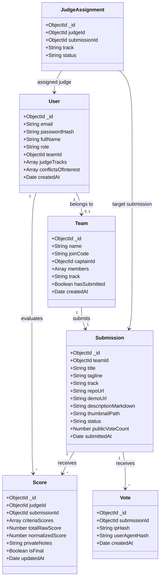

# Software Requirements Specification (SRS) — Dogfood 2026
**Standard:** IEEE Std 830-1998 Compliant  
**Document ID:** `SRS-DOGFOOD-2026-V1`  
**System Title:** Dogfood 2026 Self-Hosted Hackathon Platform  
**Target Event:** Hackathon Raptors 2026  
**Authors:** Dogfood 2026 Engineering Team (Somnath, Falguni, Om Apar)  
**Status:** Approved Technical Baseline  

---

> [!IMPORTANT]
> **Air-Gap Operational Mandate**  
> All requirements specified herein must be fully satisfied without outbound internet connectivity. System operation relies exclusively on internal services within the local Docker network (`dogfood-net`).

---

## Table of Contents
1. [Introduction](#1-introduction)
   - [1.1 Purpose](#11-purpose)
   - [1.2 Document Conventions & Priority Classification](#12-document-conventions--priority-classification)
   - [1.3 Intended Audience & Reading Suggestions](#13-intended-audience--reading-suggestions)
   - [1.4 Product Scope](#14-product-scope)
   - [1.5 References](#15-references)
2. [Overall Description](#2-overall-description)
   - [2.1 Product Perspective & Context](#21-product-perspective--context)
   - [2.2 User Classes & Characteristics](#22-user-classes--characteristics)
   - [2.3 Operating Environment & System Boundaries](#23-operating-environment--system-boundaries)
   - [2.4 Design & Implementation Constraints](#24-design--implementation-constraints)
   - [2.5 Assumptions & Dependencies](#25-assumptions--dependencies)
3. [System Data Model & Entity Relationships](#3-system-data-model--entity-relationships)
4. [Specific Functional Requirements](#4-specific-functional-requirements)
   - [4.1 Authentication & Session Management (`SRS-F01` – `SRS-F03`)](#41-authentication--session-management-srs-f01--srs-f03)
   - [4.2 Team Formation & Member Lifecycle (`SRS-F04` – `SRS-F06`)](#42-team-formation--member-lifecycle-srs-f04--srs-f06)
   - [4.3 Project Submission & File Asset Pipeline (`SRS-F07` – `SRS-F09`)](#43-project-submission--file-asset-pipeline-srs-f07--srs-f09)
   - [4.4 Deadline Lock & Public Showcase Gallery (`SRS-F10` – `SRS-F11`)](#44-deadline-lock--public-showcase-gallery-srs-f10--srs-f11)
   - [4.5 Weighted Rubric Configuration (`SRS-F12`)](#45-weighted-rubric-configuration-srs-f12)
   - [4.6 Constraint-Satisfied Judge Assignment Engine (`SRS-F13`)](#46-constraint-satisfied-judge-assignment-engine-srs-f13)
   - [4.7 Backend Route-Level Score Isolation (`SRS-F14`)](#47-backend-route-level-score-isolation-srs-f14)
   - [4.8 Statistical Normalization Engine (`SRS-F15` – `SRS-F16`)](#48-statistical-normalization-engine-srs-f15--srs-f16)
   - [4.9 Organizer Command Center & CSV Export (`SRS-F17` – `SRS-F18`)](#49-organizer-command-center--csv-export-srs-f17--srs-f18)
   - [4.10 Sybil-Resistant Community Voting & Anti-Abuse (`SRS-F19` – `SRS-F20`)](#410-sybil-resistant-community-voting--anti-abuse-srs-f19--srs-f20)
   - [4.11 Immutable Audit Logging (`SRS-F21`)](#411-immutable-audit-logging-srs-f21)
   - [4.12 Pairwise Evaluation & Stretch Features (`SRS-F22` – `SRS-F23`)](#412-pairwise-evaluation--stretch-features-srs-f22--srs-f23)
5. [External Interface Requirements](#5-external-interface-requirements)
   - [5.1 User Interfaces](#51-user-interfaces)
   - [5.2 Hardware Interfaces](#52-hardware-interfaces)
   - [5.3 Software & Database Interfaces](#53-software--database-interfaces)
   - [5.4 Communications Interfaces](#54-communications-interfaces)
6. [Non-Functional Requirements & System Quality Attributes](#6-non-functional-requirements--system-quality-attributes)
7. [Traceability Matrix](#7-traceability-matrix)
8. [Document Revision History](#8-document-revision-history)

---

## 1. Introduction

### 1.1 Purpose
This Software Requirements Specification (SRS) establishes the complete, authoritative technical requirements for **Dogfood 2026**, an offline-first, self-hosted hackathon submission, judging, and community platform. It serves as the baseline for implementation, quality assurance, security verification, and hackathon evaluation compliance.

### 1.2 Document Conventions & Priority Classification
Every requirement in this specification is assigned an identifier and priority:
- **`SRS-Fxx`**: Functional Requirement.
- **`SRS-NFxx`**: Non-Functional Requirement.
- **Priority Ratings:**
  - **[M] Mandatory (Tier 1):** Essential prerequisites for baseline platform execution.
  - **[H] High Priority (Tier 2):** Critical for judging integrity, isolation, and scoring normalization (25% hackathon weight).
  - **[M-P] Medium Priority (Tier 3):** Required for public participation, anti-abuse security, and audit trails.
  - **[O] Optional / Stretch (Tier 4):** Value-add capabilities including Bradley-Terry pairwise ranking and SVG certificate generation.

### 1.3 Intended Audience & Reading Suggestions
- **Developers (Somnath, Falguni, Om Apar):** Reference Section 3 (Data Models), Section 4 (Functional Requirements), and Section 5 (Interfaces) for implementation details.
- **Judges / Evaluators:** Review Section 2.1 (Perspective), Section 4.7 (Isolation), and Section 4.8 (Normalization) to verify tournament fairness and zero-leak guarantees.
- **DevOps / SysAdmins:** Review Section 2.3 (Environment), Section 5 (Interfaces), and Section 6 (Non-Functional Requirements) for deployment configurations.

### 1.4 Product Scope
Dogfood 2026 replaces brittle cloud-based SaaS hackathon tools. The software package comprises:
1. `frontend`: React 18 single-page application built with Vite and Tailwind CSS.
2. `api`: Node.js 20 and Express 4 core transactional REST service.
3. `judging-service`: Python 3.11 and FastAPI statistical computation engine.
4. `mongodb`: MongoDB 7.0 document database pre-seeded with tournament fixture data.

### 1.5 References
- IEEE Std 830-1998: IEEE Recommended Practice for Software Requirements Specifications.
- RFC 7519: JSON Web Token (JWT) Architectural Standard.
- Bradley, R. A., & Terry, M. E. (1952). *Rank Analysis of Incomplete Block Designs: I. The Method of Paired Comparisons*. Biometrika.
- Gelman, A., et al. (2013). *Bayesian Data Analysis* (3rd ed.) — Empirical Bayes shrinkage principles.

---

## 2. Overall Description

### 2.1 Product Perspective & Context
Dogfood 2026 operates as a self-contained local system running inside a unified Docker network (`dogfood-net`). It eliminates all external internet dependencies, providing total operational resilience during venue connectivity disruptions.

```
       +-------------------------------------------------------+
       |                     Host Machine                      |
       |  (Browser: localhost:3000 -> Host Ingress: Port 3000)  |
       +---------------------------+---------------------------+
                                   |
                   +---------------+---------------+
                   |   Docker Bridge: dogfood-net  |
                   +---------------+---------------+
                                   |
         +-------------------------+-------------------------+
         |                                                   |
+--------v--------+       +-------------------+       +------v------+
| React Frontend  | ----> |  Node/Express API | <---> |   FastAPI   |
|   (Port 80)     | REST  |    (Port 5000)    | REST  | (Port 8000) |
+-----------------+       +---------+---------+       +-------------+
                                    |
                          +---------v---------+
                          |   MongoDB 7.0     |
                          |   (Port 27017)    |
                          +-------------------+
```

### 2.2 User Classes & Characteristics

| User Class | Role Identifier | Technical Sophistication | Primary Objectives | Security Boundary |
|---|---|---|---|---|
| **Public Visitor** | `visitor` | Low to Moderate | Browse gallery, search projects, cast upvotes | Strictly limited to public read endpoints and rate-limited voting |
| **Participant** | `participant` | High | Register, create/join team, draft and submit project | Cannot view unsubmitted drafts of other teams; cannot view judging data |
| **Judge** | `judge` | High | Evaluate assigned submissions against weighted rubrics | Restricted strictly to assigned projects; zero access to competing judge ballots |
| **Organizer** | `organizer` | High | Configure event, assign judges, run normalization, export CSV | Full administrative oversight over event data and leaderboards |
| **System Admin** | `admin` | Advanced | Monitor container health, execute backups, audit security logs | Unrestricted root-level access to system configurations |

### 2.3 Operating Environment & System Boundaries
- **Container Engine:** Docker Engine v24.0+ and Docker Compose v2.20+.
- **Host Operating Systems:** Linux (Ubuntu 22.04 LTS+), macOS (13 Ventura+), Windows 10/11 with WSL2.
- **Hardware Minimum:** x86_64 or ARM64 (Apple Silicon), 2.0 GHz dual-core CPU, 4 GB physical RAM, 10 GB free disk space.
- **Network Boundary:** 100% loopback (`localhost`). Zero outbound TCP/UDP traffic permitted outside `dogfood-net`.

### 2.4 Design & Implementation Constraints
- **Stateless API:** Node.js API must not store user sessions in local process memory; JWT tokens in HTTP-only cookies enable horizontal scaling.
- **Relational Integrity in Document DB:** Mongoose schema validators and MongoDB compound indexes must enforce uniqueness for join codes, submission links, and single-ballot constraints.
- **Air-Gap Asset Vendoring:** No runtime CDN calls (`<script src="https://cdn...">`). All fonts, icons, CSS, and JS libraries must be bundled locally.

### 2.5 Assumptions & Dependencies
- Docker and Docker Compose are installed and operational on the host machine prior to launch.
- Host machine clock is synchronized to prevent artificial deadline expirations.

---

## 3. System Data Model & Entity Relationships



---

## 4. Specific Functional Requirements

### 4.1 Authentication & Session Management (`SRS-F01` – `SRS-F03`)

#### `SRS-F01` [M]: Local User Registration & Password Hashing
- **Description:** The system shall register users locally without external identity providers.
- **Inputs:** `email` (RFC 5322 format), `password` (min 8 chars, 1 number, 1 symbol), `fullName`, `role` (optional, default `participant`).
- **Processing:** Check unique email index; hash password via `bcrypt` with salt rounds = 10; create `User` document.
- **Outputs:** HTTP 201 Created with sanitized user object (excluding `passwordHash`).
- **Error Handling:** Duplicate email returns `HTTP 409 Conflict`. Validation failure returns `HTTP 400 Bad Request`.

#### `SRS-F02` [M]: Stateless JWT Authentication
- **Description:** The system shall authenticate user credentials and issue cryptographic JSON Web Tokens.
- **Inputs:** `email`, `password`.
- **Processing:** Find user by email; compare password hash via `bcrypt.compare`; generate signed JWT access token (60 min expiry) and refresh token (7 days expiry). Set tokens in secure HTTP-only cookies.
- **Outputs:** HTTP 200 OK with user profile and role payload.
- **Error Handling:** Invalid credentials return `HTTP 401 Unauthorized` with generic message to prevent account enumeration.

#### `SRS-F03` [M]: Role-Based Route Authorization Middleware
- **Description:** Express middleware `roleGuard(allowedRoles)` shall intercept protected endpoints and enforce RBAC.
- **Processing:** Extract and verify JWT; verify `req.user.role` against `allowedRoles`.
- **Outputs:** Calls `next()` if authorized; returns `HTTP 401` if token missing/expired; returns `HTTP 403 Forbidden` if role unauthorized.

---

### 4.2 Team Formation & Member Lifecycle (`SRS-F04` – `SRS-F06`)

#### `SRS-F04` [M]: Team Creation & Join Code Generation
- **Description:** A registered participant without an existing team can create a team and become its captain.
- **Inputs:** `teamName` (unique string, 3-30 chars), `track` (valid event track).
- **Processing:** Generate a random, cryptographically secure 6-character uppercase alphanumeric `joinCode` (excluding ambiguous characters: `I`, `O`, `0`, `1`). Ensure uniqueness via loop validation. Set `captainId = req.user.id`.
- **Outputs:** HTTP 201 Created with team object and join code.
- **Error Handling:** If user already belongs to a team, return `HTTP 400 Bad Request: Already enrolled in a team`.

#### `SRS-F05` [M]: Joining a Team via Join Code
- **Description:** A participant can join an existing team using the 6-character code.
- **Inputs:** `joinCode` (6 characters).
- **Processing:** Locate team by uppercase `joinCode`; verify `team.members.length < 4`; push `req.user.id` to `members`; update user's `teamId`.
- **Outputs:** HTTP 200 OK with updated team roster.
- **Error Handling:** If code not found, return `HTTP 404 Not Found`. If team is full ($\ge 4$ members), return `HTTP 400 Bad Request: Team capacity reached`.

#### `SRS-F06` [M]: Captain Management & Roster Authority
- **Description:** The team captain has exclusive authority to remove members or transfer captaincy prior to project submission.
- **Processing:** Check `team.captainId === req.user.id`. Disallow modifications once `team.hasSubmitted === true`.
- **Outputs:** HTTP 200 OK on successful roster update.
- **Error Handling:** Non-captains receive `HTTP 403 Forbidden`.

---

### 4.3 Project Submission & File Asset Pipeline (`SRS-F07` – `SRS-F09`)

#### `SRS-F07` [M]: Draft Creation & Auto-Save
- **Description:** Teams can iteratively draft project details with Markdown content and live client preview.
- **Inputs:** `title` (max 120 chars), `tagline` (max 250 chars), `track`, `repoUrl` (valid URL), `demoUrl`, `descriptionMarkdown`.
- **Processing:** Upsert `Submission` document with `status = 'draft'`.
- **Outputs:** HTTP 200/201 with saved submission draft.

#### `SRS-F08` [M]: Local Multipart Asset Upload Pipeline
- **Description:** The system shall accept thumbnail images and documentation assets via local disk storage.
- **Inputs:** `multipart/form-data` containing image file (JPEG, PNG, WebP $\le 5\text{ MB}$).
- **Processing:** Multer middleware validates MIME type; renames file to `UUIDv4 + extension`; saves to `./uploads/` volume mount; sets `thumbnailPath` on submission.
- **Outputs:** HTTP 200 OK with relative asset URL.
- **Error Handling:** Non-image MIME types return `HTTP 415 Unsupported Media Type`. Files $> 5\text{ MB}$ return `HTTP 413 Payload Too Large`.

#### `SRS-F09` [M]: Final Submission Lock
- **Description:** The captain finalizes the submission, transitioning status from `draft` to `submitted`.
- **Processing:** Validate all required fields (Title, Tagline, Track, Repo URL, Markdown description $\ge 100$ words). Set `status = 'submitted'`, `hasSubmitted = true`, and timestamp `submittedAt`.
- **Outputs:** HTTP 200 OK with locked submission record.

---

### 4.4 Deadline Lock & Public Showcase Gallery (`SRS-F10` – `SRS-F11`)

#### `SRS-F10` [M]: Strict Server-Side Deadline Enforcement
- **Description:** The backend shall reject all submission write operations after the event deadline passes.
- **Processing:** Compare server timestamp `Date.now()` with `Event.submissionDeadline`.
- **Outputs:** If current time exceeds deadline, reject request with `HTTP 423 Locked: Submission period has closed`.

#### `SRS-F11` [M]: Public Showcase Gallery & Instant Filter
- **Description:** Unauthenticated visitors can view all `submitted` projects with instant search and track filtering.
- **Processing:** Query MongoDB `Submission.find({ status: 'submitted' })` with title/tagline text search index.
- **Outputs:** HTTP 200 OK with project cards (excluding internal judging fields).

---

### 4.5 Weighted Rubric Configuration (`SRS-F12`)

#### `SRS-F12` [H]: Weighted Rubric Designer
- **Description:** Organizers configure custom evaluation criteria with relative weights and numeric scales.
- **Inputs:** Array of criteria objects `{ name: String, weight: Number, scaleMin: 1, scaleMax: 10, description: String }`.
- **Processing:** Validate that $\sum \text{weight} = 1.0 \pm 0.001$ and each weight $0.05 \le w_i \le 0.80$. Save to `Event.rubric`.
- **Outputs:** HTTP 200 OK with active rubric specification.
- **Error Handling:** Weights not summing to 1.0 return `HTTP 400 Bad Request: Rubric weights must total exactly 1.0`.

---

### 4.6 Constraint-Satisfied Judge Assignment Engine (`SRS-F13`)

#### `SRS-F13` [H]: Automated Greedy Assignment Algorithm
- **Description:** Distribute $N$ submitted projects across $M$ available judges minimizing workload imbalance while enforcing track alignment and zero conflicts of interest.
- **Processing Rules:**
  1. **Track Matching:** Candidate judge's `judgeTracks` must include `submission.track`.
  2. **Conflict Avoidance:** Candidate judge's `conflictsOfInterest` must NOT contain `submission.teamId`.
  3. **Workload Minimization:** Rank eligible judges by ascending count of existing assignments; select top $K$ judges (default $K=3$).
  4. **Balance Verification:** Guarantee $\max(\text{load}) - \min(\text{load}) \le 1$.
- **Outputs:** Create `JudgeAssignment` documents; return summary statistics (assignments per judge, track coverage).

---

### 4.7 Backend Route-Level Score Isolation (`SRS-F14`)

#### `SRS-F14` [H]: Cryptographic & Route-Level Score Isolation
- **Description:** Ensure that judges can never view other judges' evaluations or scores for unassigned projects.
- **Processing (`isolationGuard.js`):**
  - `GET /api/v1/judging/scores`: Automatically filters database query to `{ judgeId: req.user._id }`.
  - `GET /api/v1/judging/scores/:scoreId`: If `req.user.role === 'judge'` and `score.judgeId !== req.user._id`, immediately abort with `HTTP 403 Forbidden`.
  - Projecting score fields in public APIs is strictly prohibited.
- **Outputs:** HTTP 200 with only own evaluations; HTTP 403 on intrusion attempts.

---

### 4.8 Statistical Normalization Engine (`SRS-F15` – `SRS-F16`)

#### `SRS-F15` [H]: Z-Score Normalization
- **Description:** Python FastAPI microservice normalizes scores across judges to eliminate harsh/lenient grader bias.
- **Mathematical Specification:**
  $$Z_{ij} = \frac{X_{ij} - \mu_j}{\sigma_j + \epsilon}$$
  where $X_{ij}$ is the raw score from judge $j$ to project $i$, $\mu_j$ is judge $j$'s mean score, $\sigma_j$ is judge $j$'s standard deviation, and $\epsilon = 10^{-6}$.
- **Inputs:** Matrix of raw scores grouped by judge ID and project ID.
- **Outputs:** Matrix of normalized $Z$-scores per project and judge.

#### `SRS-F16` [H]: Empirical Bayesian Variance Shrinkage
- **Description:** For judges evaluating small sample sizes ($n_j < 5$), shrink the empirical judge mean $\mu_j$ toward global tournament mean $\mu_{\text{global}}$:
  $$\hat{\mu}_j = \frac{n_j}{n_j + k} \mu_j + \frac{k}{n_j + k} \mu_{\text{global}}$$
  where $k=3$ is the pseudo-count prior weight.
- **Processing:** Compute adjusted composite score $S_i = \frac{1}{M_i} \sum_{j=1}^{M_i} \frac{X_{ij} - \hat{\mu}_j}{\sigma_j}$. Rescale $S_i$ to $0 - 100$ scale:
  $$\text{FinalScore}_i = 100 \times \frac{S_i - \min(S)}{\max(S) - \min(S) + \epsilon}$$
- **Outputs:** Ranked tournament leaderboard with raw vs. normalized comparative metrics.

---

### 4.9 Organizer Command Center & CSV Export (`SRS-F17` – `SRS-F18`)

#### `SRS-F17` [H]: Real-Time Judging Progress Dashboard
- **Description:** Organizers can monitor live judging progress by track and judge.
- **Outputs:** Completion percentage, pending vs. completed ballots, score distribution histograms.

#### `SRS-F18` [H]: Streaming CSV and JSON Results Exporter
- **Description:** Generate downloadable CSV and JSON results files directly from backend.
- **Outputs:** Streamed `Content-Type: text/csv` containing: `Rank, Project Title, Track, Team Name, Captain Email, Raw Average Score, Normalized Final Score, Ballots Count, Composite Notes`.

---

### 4.10 Sybil-Resistant Community Voting & Anti-Abuse (`SRS-F19` – `SRS-F20`)

#### `SRS-F19` [M-P]: Sliding Window Rate Limiting
- **Description:** Public upvoting endpoints shall enforce strict rate limits.
- **Processing:** `express-rate-limit` limits client requests to 5 per minute per IP.
- **Error Handling:** Rate violation returns `HTTP 429 Too Many Requests`.

#### `SRS-F20` [M-P]: Client IP and User-Agent Hash Deduplication
- **Description:** Prevent duplicate public voting within a 24-hour window without requiring account creation.
- **Processing:** Compute `fingerprint = SHA256(req.ip + req.headers['user-agent'] + salt)`. Upsert into `Vote` collection with unique compound index `{ submissionId: 1, fingerprint: 1 }`.
- **Outputs:** HTTP 200 OK on vote cast; `HTTP 409 Conflict: Vote already registered today` on duplicate.

---

### 4.11 Immutable Audit Logging (`SRS-F21`)

#### `SRS-F21` [M-P]: Administrative & Scoring Audit Trail
- **Description:** The system shall record an append-only log of critical system operations.
- **Events Logged:** Score creation, score update, judge assignment generation, admin score override, rubric weight alteration.
- **Captured Attributes:** `timestamp`, `actorId`, `actorRole`, `actionType`, `targetEntityId`, `payloadSnapshot`, `ipAddress`.
- **Outputs:** Saved to immutable `AuditLog` collection.

---

### 4.12 Pairwise Evaluation & Stretch Features (`SRS-F22` – `SRS-F23`)

#### `SRS-F22` [O]: Bradley-Terry Pairwise Preference Estimator
- **Description:** Judges compare two submissions head-to-head. FastAPI microservice computes continuous skill ratings $\pi_i$ via iterative Minorize-Maximization (MM):
  $$\pi_i^{(t+1)} = \frac{W_i}{\sum_{j \neq i} \frac{N_{ij}}{\pi_i^{(t)} + \pi_j^{(t)}}}$$
- **Outputs:** Estimated project ratings vector $\vec{\pi}$ normalized such that $\sum \pi_i = 1.0$.

#### `SRS-F23` [O]: Offline SVG Certificate Generator
- **Description:** Generate locally rendered SVG participation and award certificates.
- **Processing:** Inject participant name, project title, and track placement into local SVG templates; stream downloadable asset.

---

## 5. External Interface Requirements

### 5.1 User Interfaces
- **Responsive Web Client:** React 18 SPA accessible on desktop, tablet, and mobile browsers.
- **Color Palette & Contrast:** WCAG 2.1 AA compliant (contrast ratio $\ge 4.5:1$).
- **Offline Indicator:** Prominent visual badge in header indicating status of local Node.js API connectivity.

### 5.2 Hardware Interfaces
- Standard Ethernet / Wi-Fi network cards (used purely for local LAN access if configured, or loopback `127.0.0.1`).
- Minimum host resources: 2 CPU cores, 4 GB RAM.

### 5.3 Software & Database Interfaces
- **Database:** MongoDB 7.0 via Mongoose 8.x ODM connection pool (`maxPoolSize: 50`).
- **Python Service:** FastAPI ASGI running via Uvicorn on internal TCP port 8000.
- **Seed Harness:** `seed/init-mongo.js` executed automatically by MongoDB entrypoint on first volume initialization.

### 5.4 Communications Interfaces
- **Client $\leftrightarrow$ Server:** HTTP/1.1 over host ports 3000 (UI) and 5000 (API).
- **Inter-Container Communication:** Docker DNS resolving `http://api:5000`, `http://judging-service:8000`, and `mongodb://mongodb:27017`.

---

## 6. Non-Functional Requirements & System Quality Attributes

| Req ID | Attribute | Specification & Metric | Verification Method |
|---|---|---|---|
| **SRS-NF01** | Performance | 95th percentile latency $\le 150\text{ ms}$ under 150 concurrent requests | k6 / Supertest load test |
| **SRS-NF02** | Security | Zero cross-judge score leakage on direct API calls | Automated penetration suite |
| **SRS-NF03** | Reliability | Automatic service restart upon failure (`restart: unless-stopped`) | Process kill test |
| **SRS-NF04** | Portability | 100% functional across Linux, macOS, and Windows WSL2 | Docker Compose validation |
| **SRS-NF05** | Air-Gap Fidelity | Zero external HTTP/HTTPS calls during complete user flow | Physical network disconnect |
| **SRS-NF06** | Data Durability | Zero data loss across container restart or host reboot | Volume persistence test |
| **SRS-NF07** | Scalability | Supports up to 200 teams, 800 participants, and 50 judges locally | Fixture scale benchmark |

---

## 7. Traceability Matrix

| PRD Feature ID | Description | SRS Functional Req | SRS Non-Functional Req |
|---|---|---|---|
| **PRD-4.1** | Local User Authentication & RBAC | `SRS-F01`, `SRS-F02`, `SRS-F03` | `SRS-NF02` |
| **PRD-4.1** | Team Formation & Join Codes | `SRS-F04`, `SRS-F05`, `SRS-F06` | `SRS-NF01`, `SRS-NF06` |
| **PRD-4.1** | Submission Lifecycle & File Upload | `SRS-F07`, `SRS-F08`, `SRS-F09` | `SRS-NF06` |
| **PRD-4.1** | Deadline Lock & Showcase Gallery | `SRS-F10`, `SRS-F11` | `SRS-NF01` |
| **PRD-4.2** | Weighted Rubric Builder | `SRS-F12` | `SRS-NF06` |
| **PRD-4.2** | Judge Assignment Solver | `SRS-F13` | `SRS-NF01`, `SRS-NF07` |
| **PRD-4.2** | Route Score Isolation | `SRS-F14` | `SRS-NF02` |
| **PRD-4.2** | Z-Score & Bayesian Normalization | `SRS-F15`, `SRS-F16` | `SRS-NF01` |
| **PRD-4.2** | Live Leaderboard & CSV Export | `SRS-F17`, `SRS-F18` | `SRS-NF01` |
| **PRD-4.3** | Community Voting & Anti-Abuse | `SRS-F19`, `SRS-F20` | `SRS-NF02` |
| **PRD-4.3** | Immutable Audit Logging | `SRS-F21` | `SRS-NF06` |
| **PRD-4.4** | Bradley-Terry Pairwise Ranking | `SRS-F22` | `SRS-NF01` |
| **PRD-4.4** | Offline Certificates | `SRS-F23` | `SRS-NF05` |

---

## 8. Document Revision History

| Version | Date | Author(s) | Summary of Changes |
|---|---|---|---|
| `v1.0.0` | Sept 2026 | Somnath, Falguni, Om Apar | Complete IEEE Std 830-1998 compliant specification approved for implementation. |
